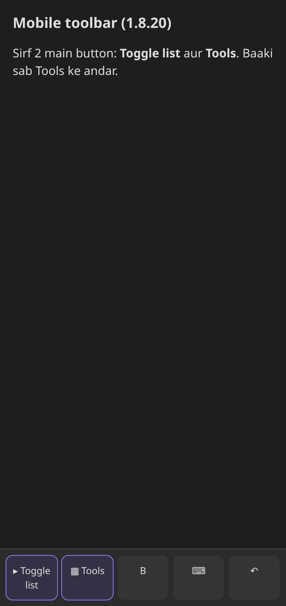
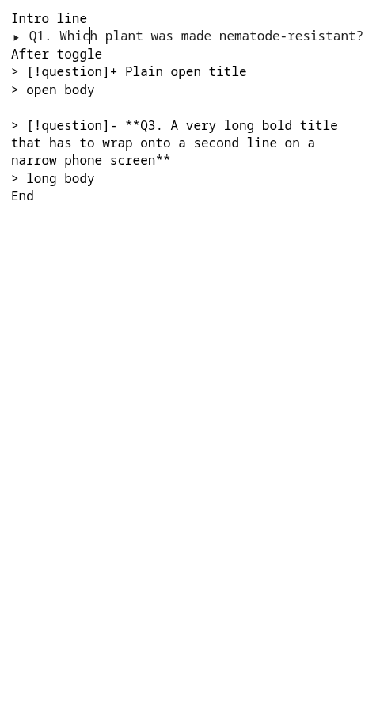
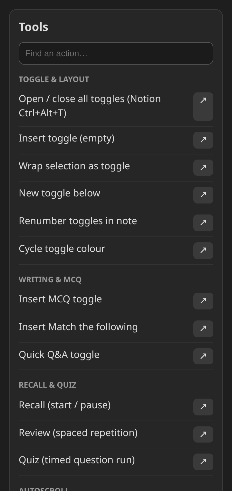
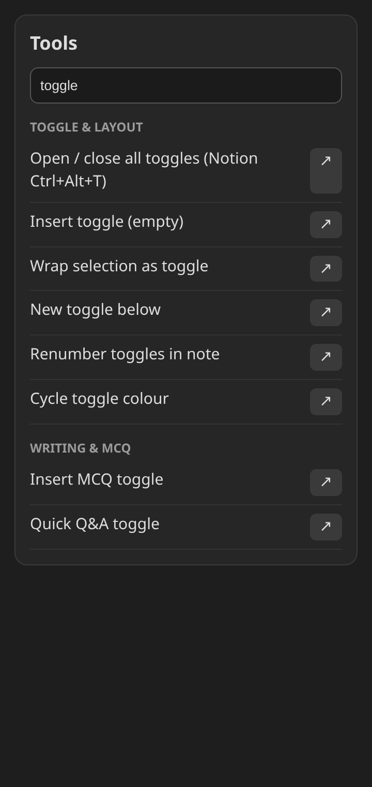
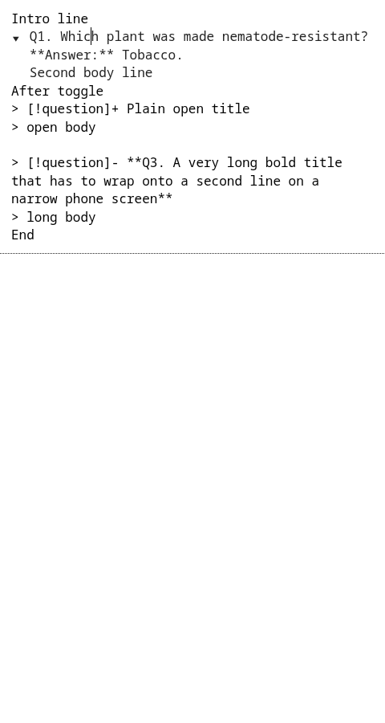
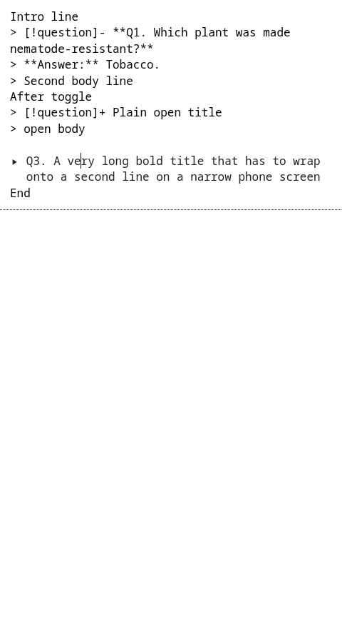
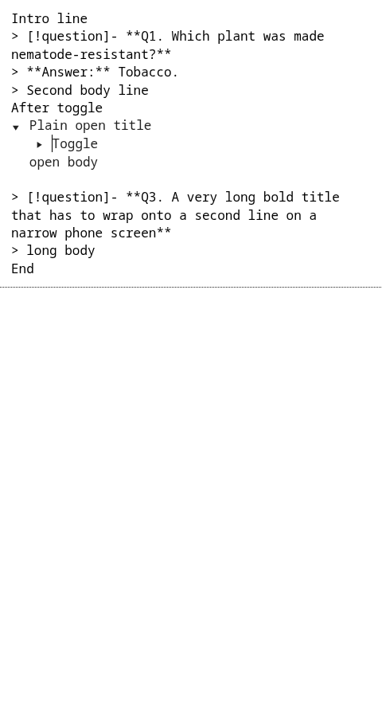

# Notion Toggle Plugin — Poori Hindi Guide (1.8.20)

Yeh guide Obsidian ke 'Notion Toggle' plugin (version 1.8.20) ke har feature ko aasaan Hindi me samjhati hai. Har feature ko asli browser me test kiya gaya, screenshot liya gaya, aur Notion ke asli toggle se milaya gaya.

## Test result

- **Unit tests:** 1364 / 1364 pass
- **Browser end-to-end:** 70 / 70 pass
- **Layout check (phone 360px + desktop 1280px):** 22 / 22 pass
- **Build:** Clean

## Install (BRAT)

1. Obsidian me Settings → Community plugins → Safe mode OFF karo.
2. Browse me 'BRAT' search karo → Install → Enable.
3. Command palette me 'BRAT: Add a beta plugin for testing' chalao.
4. Repo daalo: RR-LIBRARY/obsidian-notion-toggle → 'Latest version' rehne do → Add plugin.
5. Settings → Community plugins me 'Notion Toggle' ka switch ON hai, check karo.

## Features

### Toolbar: sirf 2 button

**Kya karta hai:** Phone toolbar par ab sirf 'Toggle list' aur 'Tools' chahiye. Baaki 50+ kaam Tools ke andar hain.

**Kaise use karein:**
1. Settings → Mobile → Manage toolbar kholo.
2. 'Toggle list' aur 'Tools' add karo.
3. Purane extra button hata do.

> Tip: Toolbar jitna chhota, likhna utna tez. Jo kaam roz nahi karte, woh Tools me hi rehne do.

### Toggle list button

**Kya karta hai:** Cursor wali line ko toggle bana deta hai. Text select kiya ho to poora selection ek toggle me chala jaata hai.

**Kaise use karein:**
1. Line par cursor rakho.
2. Toolbar me 'Toggle list' dabao.
3. Title likho, Enter dabao, andar answer likho.

> Tip: Question ko title aur answer ko andar likho — baad me band karke khud ko test kar sakte ho (active recall).

### Tools menu (sab ek jagah)

**Kya karta hai:** Saare features 6 group me: Toggle & layout, Writing & MCQ, Recall & quiz, Autoscroll, Research, Settings.

**Kaise use karein:**
1. Toolbar me 'Tools' dabao.
2. Group me se kaam chuno, ya upar search karo.

> Tip: Naam yaad nahi? Search box me bas 'toggle', 'quiz' ya 'mcq' likho.

### Tools menu me search

**Kya karta hai:** Search likhte hi sirf matching kaam dikhte hain.

**Kaise use karein:**
1. Tools kholo.
2. 2-3 akshar likho, result par tap karo.

> Tip: Purane shortcuts aur command naam badle nahi hain — jo yaad hai woh chalta rahega.

### Toggle kholna / band karna

**Kya karta hai:** Ctrl+Enter (Mac: Cmd+Enter) se cursor wala toggle khulta/band hota hai — bilkul Notion jaisa.

**Kaise use karein:**
1. Toggle ke title par cursor rakho.
2. Ctrl+Enter dabao.
3. Ya arrow ▸ par tap karo.

> Tip: Band toggle ka answer chhup jaata hai; pehle socho, phir kholo.

### Saare toggles ek saath

**Kya karta hai:** 'Open / close all toggles' — Ctrl+Alt+T (Mac: Cmd+Option+T). Notion ka same shortcut.

**Kaise use karein:**
1. Note kholo.
2. Ctrl+Alt+T dabao — sab khul jaayenge; dobara dabao — sab band.

> Tip: Revision se pehle sab band karo, phir ek-ek khol kar khud ko test karo.

### Lamba title — saaf wrap

**Kya karta hai:** Lamba question agli line par title ke neeche hi aata hai; arrow pehli line par tika rehta hai.

**Kaise use karein:**
1. Kuch karna nahi — apne aap hota hai.

> Tip: Phone (360px) aur desktop dono par test kiya gaya.

### Toggle ke andar toggle (Enter)

**Kya karta hai:** Toggle ke andar Enter dabane par naya toggle banta hai (auto-continue).

**Kaise use karein:**
1. Toggle ke andar likho.
2. Enter dabao — naya toggle.
3. Khali line par dobara Enter — normal line.

> Tip: Chapter → Topic → Question jaisa structure banao.

### Tab / Shift+Tab se level

**Kya karta hai:** Tab se toggle ek level andar, Shift+Tab se bahar. 12+ level tak test kiya.

**Kaise use karein:**
1. Toggle ki line par cursor rakho.
2. Tab = andar, Shift+Tab = bahar.

> Tip: 3 level se zyada gehra na jaao — padhna mushkil ho jaata hai.

### Nested layout

**Kya karta hai:** Andar wala toggle ek barabar kadam andar khiskta hai, uska answer uske neeche seedha.

**Kaise use karein:**
1. Kuch karna nahi.

> Tip: Notion jaisi seedhi line — aankh ko thakan kam.

### Drag karke jagah badlo

**Kya karta hai:** Arrow pakad kar toggle ko upar/neeche khincho — poora toggle (andar ke saath) move hota hai.

**Kaise use karein:**
1. Arrow ▸ ko pakdo.
2. Nayi jagah le jaa kar chhodo.

> Tip: Question ka order badalna ho to copy-paste ki zaroorat nahi.

### Phone par touch drag

**Kya karta hai:** Phone par ungli se bhi same drag chalta hai.

**Kaise use karein:**
1. Arrow ko thoda der dabao.
2. Khincho aur chhodo.

> Tip: Scroll aur drag alag hain — pehle halka sa dabakar rukna zaroori.

### Notion se paste

**Kya karta hai:** Notion se copy karke paste karo — toggles, nested toggles aur toggle headings (##) sahi bante hain.

**Kaise use karein:**
1. Notion me blocks select → Ctrl+C.
2. Obsidian me Ctrl+V.

> Tip: Paste ke baad heading ka level (##) waisa hi rehta hai — dobara format nahi karna.

## Aur features (Tools ke andar)

- **MCQ / Match the following:** Tools → Writing & MCQ. Options checkbox ke saath toggle me aate hain.
- **Quiz (timed):** Tools → Recall & quiz → Quiz. Har question ke liye timer, phir answer khud khulta hai.
- **Recall + Review:** Spaced repetition: kamzor question zyada baar aate hain.
- **Autoscroll:** Revision ke liye note apne aap scroll hota hai; speed, reverse, pause Tools me.
- **Colour:** Toggle ko red → yellow → green karo: kitna yaad hai uske hisaab se.

## Shortcuts

| Kaam | Obsidian (plugin) | Notion |
|---|---|---|
| Toggle banana | '>' + space | '>' + space / Ctrl+Alt+7 |
| Toggle kholo/band | Ctrl+Enter | Ctrl+Enter |
| Saare toggles | Ctrl+Alt+T | Ctrl+Alt+T |
| Level andar/bahar | Tab / Shift+Tab | Tab / Shift+Tab |
| Tools | Toolbar → Tools | / command |

## Top tips

- Question title me, answer andar — yahi sabse tez padhne ka tareeka (active recall).
- Revision se pehle Ctrl+Alt+T se sab band karo.
- Kamzor questions ko red colour do, Quiz me unhe pehle chuno.
- Notion notes seedhe paste karo — dobara type mat karo.
- Toolbar me sirf 2 button rakho; baaki Tools me search karo.

## FAQ

**Toggle khul nahi raha?** Title par cursor rakh kar Ctrl+Enter dabao, ya arrow par tap karo.

**Phone par plugin nahi dikh raha?** BRAT se install ke baad Settings → Community plugins me switch ON karo, aur Obsidian ek baar band-chalu karo.

**Purana shortcut kaam karega?** Haan — koi command ID ya shortcut nahi badla.

## Sources

- [Notion keyboard shortcuts](https://www.notion.com/help/keyboard-shortcuts)
- [Obsidian callouts](https://obsidian.md/help/callouts)
- [BRAT install guide](https://21obsidian.com/en/blog/obsidian-plugin-install-guide)
- [Callouts for study notes](https://www.obsibrain.com/blog/obsidian-callouts-complete-guide-syntax-and-customization)
